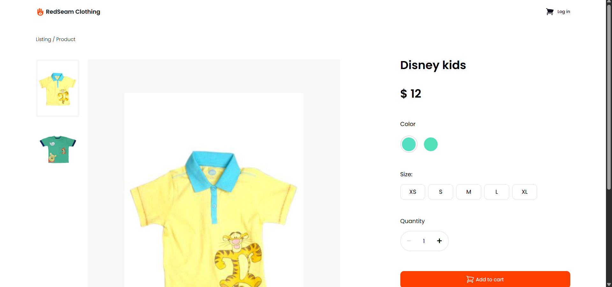
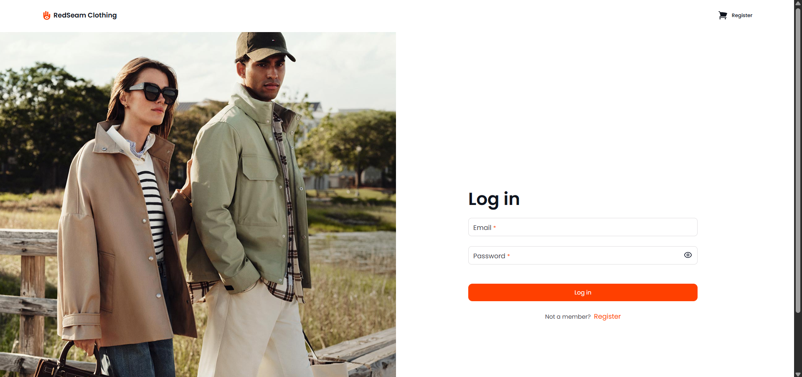
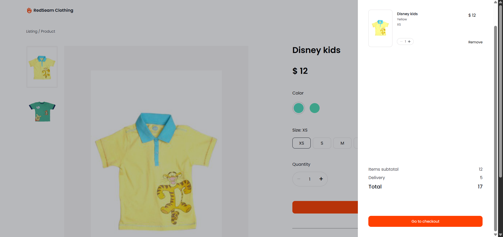

## RedSeam Clothing

RedSeam Clothing is an e-commerce web application built as part of a Redberry challenge.  
The application consumes a backend API provided by Redberry and allows users to browse products, view detailed information, and proceed through a simulated checkout flow.

## Tech Stack

- **React** – reusable UI components
- **React Router** – client-side routing
- **TypeScript** – type safety and improved developer experience
- **React Hook Form + Yup** – form handling and validation
- **Redux Toolkit (RTK Query)** – global state management and API requests
- **styled-components** – scoped and modular styling
- **Session Storage** – persisting user data across sessions
- **Vitest + React Testing Library** – unit and component testing

---

## Screenshots & Features

### Home Page

The home page displays products fetched from the backend, with 10 products per page.  
Users can:

- Navigate using pagination
- Filter products by price
- Sort products by category

If the user is not logged in, a Login button is displayed.

---

### Product Page

Clicking a product navigates to the product details page.

Features:

- Cover image with color-based image switching
- Product details fetched from the backend
- Add-to-cart functionality

Color values are provided as strings (e.g., Navy Blue, Multi).  
To visualize colors, a `string-to-color-gradient` package is used. Ideally, color hash values should be provided by the backend for better accuracy.

If the user is not logged in, adding a product to the cart will **redirect to the login page**.

### Login Page

You can use the following demo credentials to skip registration:

**Email:** `vikona@gmail.com`  
**Password:** `vikona123`

After a successful login, the user is redirected back to the previously visited page.

### Register Page

The registration page includes:

- Real-time validation messages (on change)
- Optional avatar upload (image files only)

After successful registration, the user is redirected to the home page.

### Cart Modal

The cart modal is accessible from both the home page and product page.

- Displays selected products
- Delivery fee is hardcoded to $5
- Users can proceed to the checkout page

### Checkout Page

The checkout page includes multiple input fields.

- Email is pre-filled from login (editable)
- Validation is triggered on submit

### Congratulations Modal

After submitting valid checkout data (payment is simulated), a congratulations modal appears.

Clicking Continue Shopping redirects the user to the home page.

## What I Learned

Through this project, I strengthened my knowledge of:

- User authentication and authorization
- Global state management with Redux Toolkit
- API handling using RTK Query
- Form validation with Yup
- Component and unit testing with Vitest and React Testing Library (ongoing)

## Future Improvements

- Increase test coverage using Vitest and React Testing Library
- Add integration tests for main user flows (authentication, cart, checkout)

## Getting Started

To run the project locally:

git clone <repository-link>
npm install
npm run dev
